<!-- Animated Banner -->
<picture>
  <source media="(prefers-color-scheme: dark)" srcset="./aasif-banner.svg">
  <source media="(prefers-color-scheme: light)" srcset="./aasif-banner.svg">
  
</picture>

 

<table align="center" border="0">
<tr>
<td width="38%" align="center" valign="middle">

<!-- Swinging Lanyard ID Card -->

</td>
<td width="62%" valign="middle">

### My Projects

| Project | Tech | Stars |
|:---|:---:|:---:|
| [Full-Stack Web Application](https://github.com/daraasif) | `React` `Django` `PostgreSQL` | ⭐ |
| [REST API Service](https://github.com/daraasif) | `Python` `DRF` `SQL` | ⭐ |
| [UI Component Library](https://github.com/daraasif) | `React` `CSS` `JS` | ⭐ |
| [Data Dashboard](https://github.com/daraasif) | `Python` `SQL` `JavaScript` | ⭐ |
| [Open Source Toolkit](https://github.com/daraasif) | `Python` `Django` `Docker` | ⭐ |

 

> 💜 *"Ship fast, iterate faster, never stop learning."*

</td>
</tr>
</table>

 

### GitHub Stats and Graphs

  

<!-- Activity Graph -->

  

<!-- Trophies (local animated SVG — always loads) -->

  

### Watch the snake eat my contributions

<picture>
  <source media="(prefers-color-scheme: dark)" srcset="https://raw.githubusercontent.com/daraasif/daraasif/output/github-contribution-grid-snake-dark.svg">
  <source media="(prefers-color-scheme: light)" srcset="https://raw.githubusercontent.com/daraasif/daraasif/output/github-contribution-grid-snake.svg">
  
</picture>

  

### Let's Connect

  

  

*Always learning, always building.* 🚀

